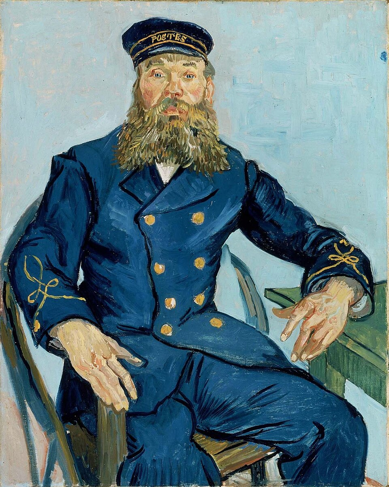

# public-notes



*"Portrait of the Postman Joseph Roulin" (1888) by Vincent van Gogh — [Wikipedia](https://en.wikipedia.org/wiki/Portraits_of_the_Postman_Joseph_Roulin)*

**A lightweight repo for sharing files and notes publicly.**

## About

This repository serves as a simple, public file-sharing space. When a file needs to be accessible via a URL -- whether it is a screenshot, a document, or a reference for another project -- it goes here. No framework, no static site generator, just files in a Git repo with GitHub serving them over the web.

## Usage

Files in this repository can be referenced directly from other projects and conversations using raw GitHub URLs:

```
https://github.com/pdelfino/public-notes/blob/main/<filename>
```
